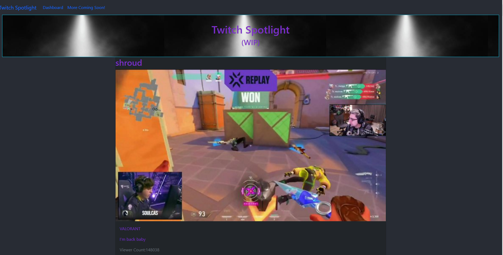

  # Twitch-Spotlight

  

    

  <!-- Titled description for grading clarity. Will remove after grading -->
  ## Description
  This project is the final project in the GA tech coding bootcamp. It is a fullstack MERN application, with an express and mongo backend, and a reactjs front end, all integrated with nodejs. This app would allow a user to be able to go to the dashboard, fill in a desired viewer count range, and be fed a list of streamers within that viewer range. This would help shed light on streamers that are less viewer-fortunate, help balance viewer gap between top streamers and smaller streamers, and promote more variety and uniqueness in available streams. Currently, the api call does not function properly on the heroku app, which seems to be an issue with heroku billing and not allowing api calls on their end without some premium plan. The api call does work locally, however, as shown in the demo png.
   

  

  
  
  ## Table of Contents
  1. [Description](#description)
  2. [Installation](#installation)
  3. [Technologies](#technologies)
  4. [Usage](#usage)
  5. [License](#license)
  6. [ContactMe](#contactme)
  

  ## Installation
  No installation necessary, but if you'd like to make a copy simply clone the repo and run npm i in the main folder.
   

  ## Technologies
  * Express
  * Nodejs
  * Reactjs
  * MongoDB
  * Mongoose
  * Twitch API

  ## Usage
  To use this app, simply follow the link here: https://frozen-garden-09825.herokuapp.com/
   

  ## License
  Link at: https://opensource.org/licenses/MIT
   
  License information: Copyright 2021 

    Permission is hereby granted, free of charge, to any person obtaining a copy of this software and associated documentation files (the "Software"), to deal in the Software without restriction, including without limitation the rights to use, copy, modify, merge, publish, distribute, sublicense, and/or sell copies of the Software, and to permit persons to whom the Software is furnished to do so, subject to the following conditions:
    
    The above copyright notice and this permission notice shall be included in all copies or substantial portions of the Software.
    
    THE SOFTWARE IS PROVIDED "AS IS", WITHOUT WARRANTY OF ANY KIND, EXPRESS OR IMPLIED, INCLUDING BUT NOT LIMITED TO THE WARRANTIES OF MERCHANTABILITY, FITNESS FOR A PARTICULAR PURPOSE AND NONINFRINGEMENT. IN NO EVENT SHALL THE AUTHORS OR COPYRIGHT HOLDERS BE LIABLE FOR ANY CLAIM, DAMAGES OR OTHER LIABILITY, WHETHER IN AN ACTION OF CONTRACT, TORT OR OTHERWISE, ARISING FROM, OUT OF OR IN CONNECTION WITH THE SOFTWARE OR THE USE OR OTHER DEALINGS IN THE SOFTWARE.
    
    

   

  
   

  ## ContactMe
  Conner Saxton:
  https://github.com/rstadev
   
  Jordan Mitchell: https://github.com/JMitchell95
   
   

